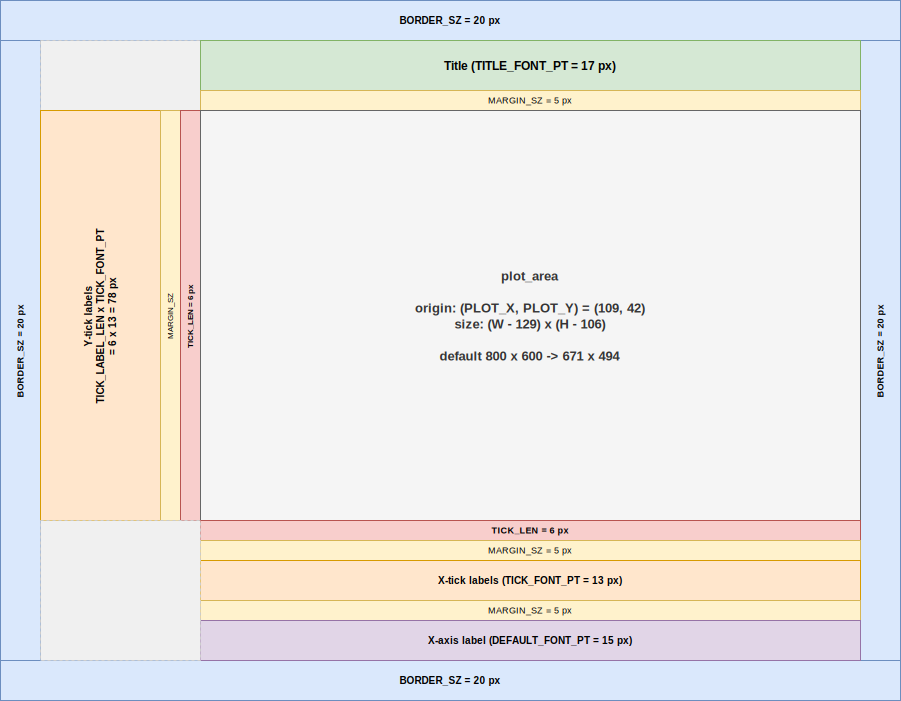

# plot

2D time-series plotting

## Design considerations

- Support a range of point and line styles
- Show/hide legend
- Visually simple layout
  - Dark background
  - Monospace white text annotations and labels
  - Auto initialised visually pleasing trace colors 
- Functional but minimal interactive controls
  - Pointer left click + move up/down: pan vertically
  - Scroll wheel: zoom along X axis, with undo support
  - Ctrl + Scroll: zoom in and out Y axis, centered at the cursor
  - Double click: resets view
  - Draggable legend
  - 'f' key toggles FPS diagnostics

## Roadmap

- [ ] Add `Window::createTrace(name, capacity, color, line_style, point_style)`
- [ ] Refactor `Window::trace(name) -> std::optional<Trace&>` to only return existing `Trace`
- [ ] Highlight selected trace (reduce opacity of all other traces)
- [ ] Set/hide visual _bug_

## Plot Window Layout

Constant          | Role
------------------|------
`BORDER_SZ`       | Outer padding on every edge 
`MARGIN_SZ`       | Gap between adjacent elements 
`TITLE_FONT_PT`   | Title text height 
`DEFAULT_FONT_PT` | Axis-label and legend text height |
`TICK_FONT_PT`    | Tick-label text height |
`TICK_LEN`        | Tick mark length (both axes) |
`TICK_LABEL_LEN`  | Max significant digits in a tick label |

