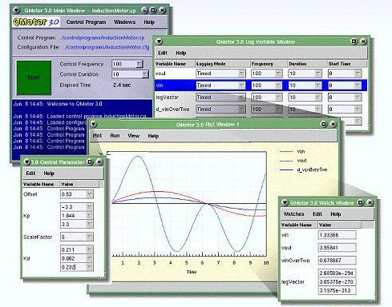

# Software system for remote control of a test rig

## Modern QMotor Concept

Build a better QMotor, for modern robotics experiments

What makes QMotor awesome as a tool for real-time system development

- Hardware servers at highest priority
- GUI to tune control parameters and view realtime plots
- Programs run in non-privileged mode.
- Program can run without gui
- GUI cannot delay control program as it runs at a lower priority
- Server scripts (configuration)
- Log variables window - multiple parameters can be selected at once to change logging configuration
- Plot window allows multiple logs to select, color, realtime update, mouse over on plot, scroll bars
- Multi window interface
- Global options for display format
- Entire configuration saved to disk
- Runs on PC - no dsp required
- Uses QNX for realtime operation
- Structure of a qmotor program template. Easy to build upon.
- Simple GUI.
- Reliable. 
- Detachable gui. Use gui for tuning, command line for deployment.
- Client-Server architecture
  - Decouples hardware (sensors, actuators) from software (intelligence)
  - Hardware servers allow sharing hardware (timer, I/O board) with multiple clients
- Online control parameter tuning
  - Predefined min, max and default values
  - Log when parameter was modified
  - On the plant side, variable change happens at user determined points in code. Supervisor is informed when a change in parameter goes live on the plant side
- Parameter logging and plotting
  - Realtime plot
  - plotting functionality details...
  - logging functionality details...
  - Watch windows
- Real-time math library 
- Linear algebra and filter function blocks
- Message passing (handleMessages)
- Status messages
- Configuration files
- Error handling - math, timing, IO

## Concepts

**Live view**

**Log replay**

**QMotor**

## Build incrementally

- Develop requirements. Consider combining controller, monitor and this README into a single document
- Build [plot](../../experimental/plot/README.md) to plot any time-series data stream
- Build [teleop](../../experimental/robot/locomotion/teleop/README.md) for remote control
- Build [camera](../../camera/README.md) to broadcast live view of rig
- Build [drake](../../experimental/drake/README.md) for data logging
- Build [linalg](../../experimental/linalg/README.md) for math and dsp
