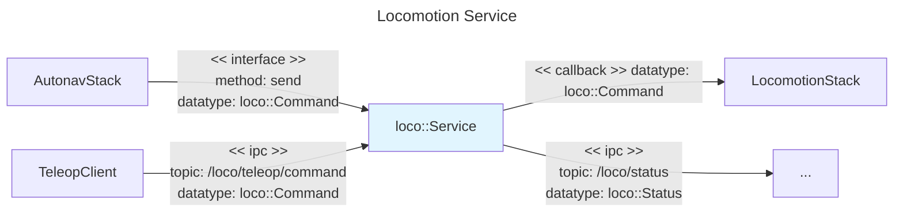

# README: Locomotion service

## Brief

Locomotion service enables remote clients to move the robot via its locomotion stack

```mermaid
---
title: Locomotion Service
---
graph LR
    %% Input flows
    AutonavStack --> | << interface >> <br> method: send <br> datatype: loco::Command | loco::Service
    TeleopClient --> | << ipc >> <br> topic: /loco/teleop/command <br> datatype: loco::Command | loco::Service
    
    
    %% Output flows
    loco::Service --> | << callback >> datatype: loco::Command | LocomotionStack
    loco::Service --> | << ipc >> <br> topic: /loco/status <br> datatype: loco::Status | ...

    %% Styling
    classDef service fill:#e1f5fe
    
    class loco::Service service
    class TeleopClient,AutonavStack,LocomotionStack external
```

## Detailed description

See documentation inline