# README: Locomotion service

## Brief

Locomotion service enables remote clients to move the robot via its locomotion stack

## System Architecture

The locomotion service follows a microservice architecture with clear separation of concerns:

```mermaid
---
title: LocomotionService - Internal Block Diagram (IBD)
---
graph TB
    subgraph LocomotionService["🎯 LocomotionService"]
        subgraph Ports["Ports"]
            CmdPort["cmdIn : CommandPort"]
            SendPort["sendIn : DirectCallPort"]
            StatusPort["statusOut : StatusPort"]
            StackPort["stackOut : CallbackPort"]
        end
        
        subgraph Parts["Parts"]
            CmdHandler["cmdHandler : CommandHandler"]
            Validator["validator : CommandValidator"]
            SafetyMon["safetyMonitor : SafetyMonitor"]
            Processor["processor : CommandProcessor"]
            StatusRep["statusReporter : StatusReporter"]
        end
        
        %% Internal connections (connectors)
        CmdPort -.->|commands| CmdHandler
        SendPort -.->|send| CmdHandler
        
        CmdHandler -->|rawCommand| Validator
        Validator -->|validCommand| SafetyMon
        SafetyMon -->|safeCommand| Processor
        Processor -->|status| StatusRep
        
        StatusRep -.->|status| StatusPort
        Processor -.->|callback| StackPort
    end
    
    %% External connections
    IPCTopic["robot/loco/teleop/command<br/>«topic»"] -.-> CmdPort
    DirectCall["send()<br/>«operation»"] -.-> SendPort
    
    StatusPort -.-> IPCStatus["robot/loco/status<br/>«topic»"]
    StackPort -.-> LocoStack["Robot Locomotion Stack<br/>«system»"]
    
    %% Styling
    classDef portClass fill:#e1f5fe,stroke:#0277bd,stroke-width:2px
    classDef partClass fill:#f3e5f5,stroke:#7b1fa2,stroke-width:2px
    classDef externalClass fill:#e8f5e8,stroke:#388e3c,stroke-width:2px
    classDef serviceClass fill:#fff3e0,stroke:#f57c00,stroke-width:3px
    
    class CmdPort,SendPort,StatusPort,StackPort portClass
    class CmdHandler,Validator,SafetyMon,Processor,StatusRep partClass
    class IPCTopic,DirectCall,IPCStatus,LocoStack externalClass
    class LocomotionService serviceClass
```

### IBD Elements

**Ports (Interface Points):**
- `cmdIn : CommandPort` - Receives teleoperation commands from IPC
- `sendIn : DirectCallPort` - Receives direct function calls
- `statusOut : StatusPort` - Publishes status information via IPC
- `stackOut : CallbackPort` - Sends callbacks to locomotion stack

**Parts (Internal Components):**
- `cmdHandler : CommandHandler` - Processes incoming commands from both interfaces
- `validator : CommandValidator` - Validates command parameters and constraints
- `safetyMonitor : SafetyMonitor` - Enforces safety rules and emergency stops
- `processor : CommandProcessor` - Translates commands for locomotion stack
- `statusReporter : StatusReporter` - Generates and publishes status updates

**Connectors:**
- Internal data flow: `cmdHandler → validator → safetyMonitor → processor → statusReporter`
- External interfaces: IPC topics and direct function calls via ports

## Detailed description

See documentation inline